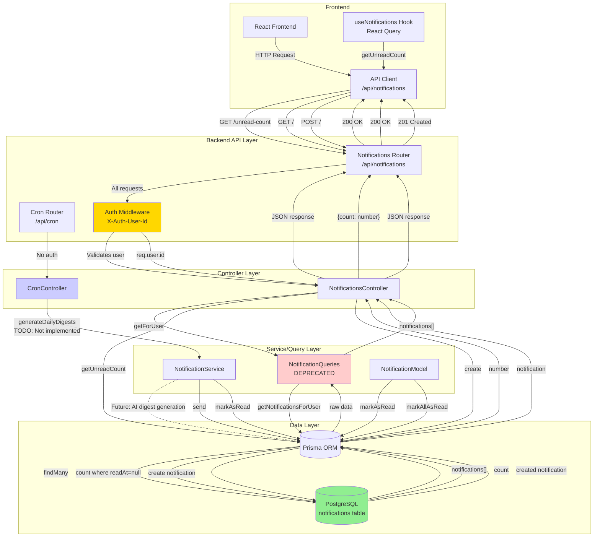

# Notification Endpoints Data Flow Diagram

## Overview

This document describes the data flow for all notification-related endpoints in the system.

## Data Flow Diagram



## Endpoint Details

### 1. GET /api/notifications

**Purpose:** Retrieve all notifications for the authenticated user

**Flow:**

1. Frontend makes GET request to `/api/notifications`
2. Request passes through Auth Middleware (validates `X-Auth-User-Id` header)
3. `NotificationsController.getForUser()` is called
4. Controller uses `NotificationQueries.getNotificationsForUser(userId)`
5. Query executes Prisma `findMany` on notifications table
6. Returns array of notification objects

**Request:**

- Headers: `X-Auth-User-Id: <userId>`
- No body required

**Response:**

```json
[
  {
    "id": "string",
    "userId": "string",
    "message": "string",
    "type": "string",
    "readAt": "Date | null",
    "createdAt": "Date",
    "updatedAt": "Date"
  }
]
```

---

### 2. GET /api/notifications/unread-count

**Purpose:** Get count of unread notifications for authenticated user

**Flow:**

1. Frontend makes GET request to `/api/notifications/unread-count`
2. Request passes through Auth Middleware
3. `NotificationsController.getUnreadCount()` is called
4. Controller directly queries Prisma `count()` with filter `readAt: null`
5. Returns count object

**Request:**

- Headers: `X-Auth-User-Id: <userId>`
- No body required

**Response:**

```json
{
  "count": 5
}
```

---

### 3. POST /api/notifications

**Purpose:** Create a new notification for the authenticated user

**Flow:**

1. Frontend makes POST request to `/api/notifications` with notification data
2. Request passes through Auth Middleware
3. `NotificationsController.create()` is called
4. Controller directly creates notification via Prisma `create()`
5. Returns created notification object

**Request:**

- Headers: `X-Auth-User-Id: <userId>`
- Body:

```json
{
  "message": "string",
  "type": "string"
}
```

**Response:**

```json
{
  "id": "string",
  "userId": "string",
  "message": "string",
  "type": "string",
  "readAt": null,
  "createdAt": "Date",
  "updatedAt": "Date"
}
```

---

### 4. POST /api/cron/daily-digest

**Purpose:** Generate daily notification digests for all users (scheduled job)

**Flow:**

1. External scheduler (e.g., cron job) makes POST request to `/api/cron/daily-digest`
2. Request bypasses Auth Middleware (background router)
3. `CronController.generateDailyDigests()` is called
4. **Status:** Not yet implemented (returns TODO message)

**Request:**

- No authentication required
- No body required

**Response (Current):**

```json
{
  "message": "Not implemented yet",
  "todo": "Generate AI-powered notification digests for all users"
}
```

---

## Service Layer Methods

### NotificationService.send()

**Purpose:** Service layer method for creating notifications

**Flow:**

- Validates required fields (userId, message, type)
- Creates notification via Prisma
- Returns notification object
- **Note:** Currently not used by controllers (controllers use direct Prisma calls)

### NotificationService.markAsRead()

**Purpose:** Mark a single notification as read

**Flow:**

- Finds notification by ID
- Updates `readAt` field to current timestamp
- Returns updated notification

### NotificationModel.markAsRead() / markAllAsRead()

**Purpose:** Model layer methods for marking notifications as read

**Flow:**

- `markAsRead()`: Updates single notification
- `markAllAsRead()`: Updates all unread notifications for a user
- **Note:** Currently not exposed via API endpoints

---

## Data Model

### Notification Schema

```prisma
model Notification {
  id        String    @id @default(cuid())
  userId    String
  message   String
  type      String
  readAt    DateTime?
  createdAt DateTime  @default(now())
  updatedAt DateTime  @updatedAt

  user User @relation(fields: [userId], references: [id])
}
```

---

## Architecture Notes

### Current Patterns

- **Controllers** use direct Prisma calls (deprecated pattern)
- **NotificationQueries** exists but marked as DEPRECATED
- **NotificationService** exists but not consistently used
- **Auth Middleware** validates `X-Auth-User-Id` header for all `/api` routes

### Future Improvements

- Migrate controllers to use `NotificationService` instead of direct Prisma calls
- Implement daily digest generation endpoint
- Add endpoint to mark notifications as read
- Add endpoint to mark all notifications as read
- Consider pagination for GET /api/notifications

---

## Error Handling

All endpoints use Express error handling middleware:

- Errors are caught in controller try/catch blocks
- Passed to `next(error)` which routes to error handler
- Error handler formats and returns appropriate HTTP status codes
